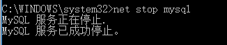
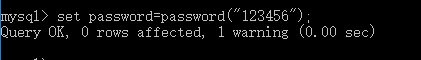
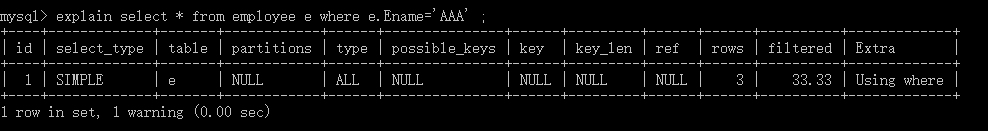
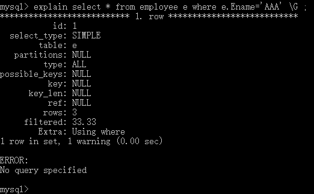

# Mysql相关操作
* mysql-5.7.18-winx64配置：
	```
	1.环境变量：
	新建环境变量，MYSQL_HOME:D:\mysql-5.7.18-winx64(mysql解压路径)
	将 %MYSQL_HOME%\bin; 添加到CLASSPATH 中去
	2.进入mysql-5.7.18-winx64目录下，新建配置文件my.ini
	文件内容：
	[mysqld]
	# 设置mysql的安装目录
	basedir=D:\mysql-5.7.18-winx64
	# 设置mysql数据库的数据的存放目录
	datadir=D:\mysql-5.7.18-winx64\data
	#设置3306端口
	port = 3306 
	# 允许最大连接数
	#max_connections=200
	# 服务端使用的字符集默认为8比特编码的latin1字符集
	character-set-server=utf8
	# 创建新表时将使用的默认存储引擎
	default-storage-engine=INNODB 
	#绑定地址
	bind-address = 127.0.0.1
	#开放远程访问权限，即可以任意密码登录
	#skip-grant-tables 
	3.以管理员方式打开cmd
	3.1，mysqld install回车(移除命令:mysqld remove)
	3.2，再输入mysqld --initialize-insecure --user=mysql
	（执行完上面命令后，MySQL会自建一个data文件夹，并且建好默认数据库，登录的用户名为root，密码为空）
	3.3，输入 net start mysql 启动服务
	3.4，输入mysql -u root -p ,默认无密码。
	3.5 将密码设置为password 
	+ 5.7.9及之前的版本
	    set password=password("password");
	+ 5.7.9之后的版本
	    ALTER USER 'root'@'localhost' IDENTIFIED BY 'password' PASSWORD EXPIRE NEVER; #修改加密规则 
   	    ALTER USER 'root'@'localhost' IDENTIFIED WITH mysql_native_password BY 'password'; #更新一下用户的密码 
            FLUSH PRIVILEGES; #刷新权限 
	```
	---
	* mysql 命令行。
	```
	1.net start mysql #开启MySQL服务
	```
	
	```
	2.net stop mysql  #关闭MySQL服务
	```
	
	```
	3.mysql -u root -p #以管理员身份登录，然后输入密码
	```
	
	```
	4.set password=password("123456");#设置MySQL密码为123456
	```
	
	```
	5.show databases; #显示所有数据库
	```
	
	```
	6.use mysql; #(mysql是数据库名称) 选择要操作的Mysql数据库，使用该命令后所有Mysql命令都只针对该数据库。
	```
	
	```
	7.show tables; #显示数据库下的表
	```
	
	```
	8.show columns from account; #显示表account 内的列
	```
	
	```
	9.select * from account;  #SQL语句使用(其他语句同理)从表account查询数据
	```
	
	```
	10.explain select * from employee e where e.Ename='AAA'; 
	#显示optimizer执行当前SQL语句所做的的操作，默认水平显示
	```
	
	```
	11.explain select * from employee e where e.Ename='AAA'\G;
	#显示optimizer执行当前SQL语句所做的的操作，\G表示垂直显示
	```
	
	```
	12. exit;退出
	```
	---
