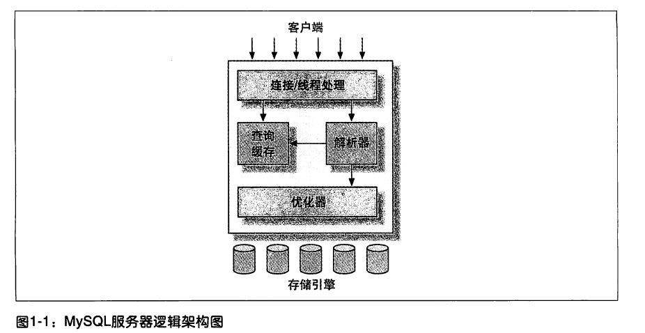
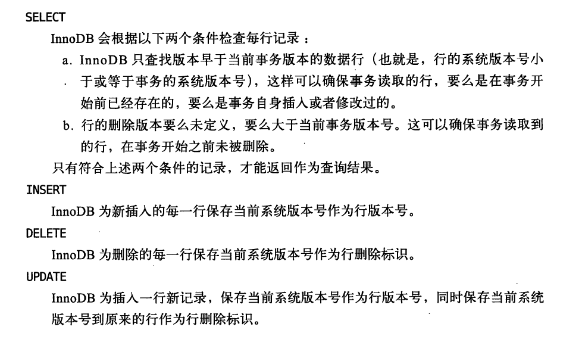
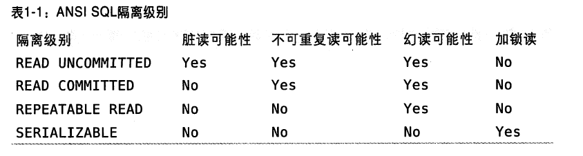

# MySQL服务架构
+ 服务器架构
---

+ 存储引擎
	+ InnoDB(默认引擎)
		+ 事务
		+ 热备份
		+ 聚簇索引
		+ 高并发(MVCC)
	+ MyISAM
		+ 表级锁(无行级锁)
		+ 全文索引
		+ 不支持事务(崩溃后无法安全恢复)
		+ 存储: 数据文件(.MYD)和索引文件(.MYI)
		+ 支持表压缩
		+ 可用于日志记录
	+ Archive
		+ 不支持事务
		+ 只支持 SELECT 和 INSERT
		+ 支持行级锁和专用缓冲区
		+ 适合日志和数据采集类应用
	+ BlackHole：一般可用于复制架构和日志审核
	+ CSV
		+ 不支持索引
		+ 可以将CVS(Comma-Separated Values)文件当做MySQL表进行处理
		+ 可用于数据交换
	+ Memory
		+ 存储不会修改，允许丢失，需要快速访问的数据
		+ 数据保存在内存中
		+ 表级锁，并发写入性能较低
		+ 表的每行长度固定
		+ 用于查找和映射表
		+ 用于缓存周期性聚合数据的结果
		+ 用于保存数据分析中产生的中间数据
	+ 第三方存储引擎(Mysql提供了插件式的存储引擎API)
+ 查询缓存
+ 并发控制
	+ 锁粒度(尽可能的小)
	+ 表锁(table lock)
	+ 行级锁(row lock)
	+ 多版本并发控制(MVCC)(InnoDB通过在每行后面添加创建时间和过期时间来实现的)
	---
	
		+ 乐观
		+ 悲观
+ 事务(ACID)
+ 事务日志(提高效率、提高系统容错力、便于数据恢复)
+ 隔离级别
	+ 未提交读(Read Uncommited)
	+ 提交读(Read Cmmited)(不可重复读)
	+ 可重复读(Repeatable Read)
	+ 可串行化(Serializable)
---

+ 死锁
	+ 死锁检测
	+ 超时机制
+ SQL语句解析-构建解析树
+ 优化
	+ 重写查询
	+ 表的读取顺序
	+ 选择合适的索引
+ 基准测试

###  STI(Something Interesting)
---
+ 支持扩展更符合互联网精神。
