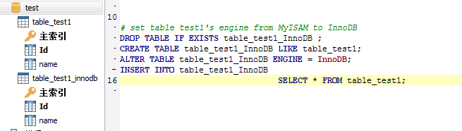
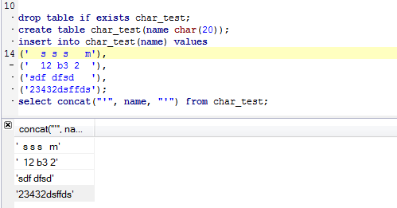
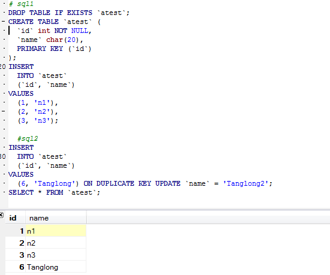
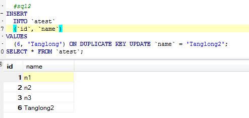

# Mysql细节
### 修改数据表引擎 
+ 直接修改
---
```mysql
alter table table_test1 engine = InnoDB; # set table_test1's engine as InnoDB
```
+ 更安全的方式
```mysql
# set table_test1's engine from MyISAM to InnoDB by creating a new table table_test1_InnoDB
DROP TABLE IF EXISTS table_test1_InnoDB ;
CREATE TABLE table_test1_InnoDB LIKE table_test1;
ALTER TABLE table_test1_InnoDB ENGINE = InnoDB;
INSERT INTO table_test1_InnoDB 
                         SELECT * FROM table_test1;
```
---

+ Mysql的char会自动去除末尾的空格
```mysql
drop table if exists char_test;
create table char_test(name char(20));
insert into char_test(name) values
('  s s s   m'),
('  12 b3 2  '),
('sdf dfsd   '),
('23432dsffds');
select concat("'", name, "'") from char_test;
```
---

+ 数据表重命名
```mysql
rename table char_test to char_test_new;
```
+ 插入更新(ON DUPLICATE KEY UPDATE)
```
# 不存在则插入， 存在则更新
# sql1
DROP TABLE IF EXISTS `atest`;
CREATE TABLE `atest` (
  `id` int NOT NULL,
  `name` char(20),
  PRIMARY KEY (`id`)
);
INSERT
  INTO `atest`
  (`id`, `name`)
VALUES
  (1, 'n1'),
  (2, 'n2'),
  (3, 'n3');
# sql2
INSERT
  INTO `atest`
  (`id`, `name`)
VALUES
  (6, 'Tanglong') ON DUPLICATE KEY UPDATE `name` = 'Tanglong2';
SELECT * FROM `atest`;
```
---

### 再次执行sql2
---


# 修改列
```mysql
DROP TABLE IF EXISTS `atest`;
CREATE TABLE `atest` (
  `id` int NOT NULL,
  `name` char(20) default 'tanglong',
  PRIMARY KEY (`id`)
);
INSERT
  INTO `atest`
  (`id`)
VALUES(1), (2);

ALTER TABLE atest
# modify column name char(20) default 'Tanglong'; # 需要创建新表，操作很慢
alter column name set default 'Tanglong'; # 直接修改.frm文件而不涉及数据，故而操作很快

INSERT
  INTO `atest`
  (`id`)
VALUES (11), (12);
select * from atest;
```
---

### STI
---
+ 复制更新是一个很有效的方式。
	+ 重命名
	+ 删表操作