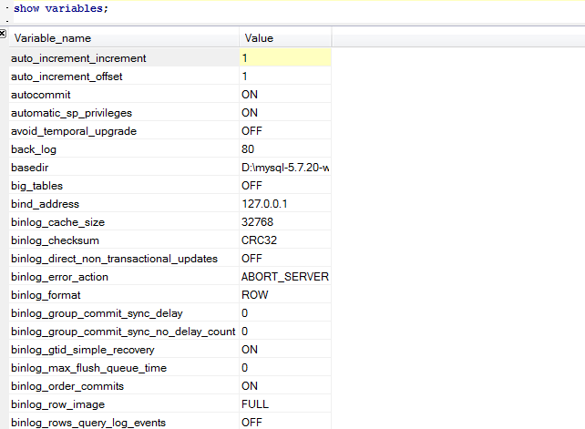
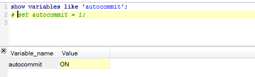
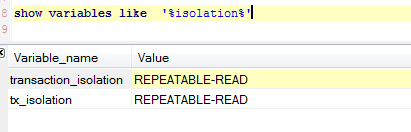
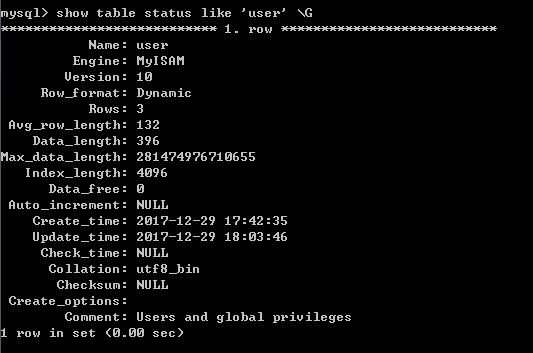

# Mysql 变量
+ 所有变量
```mysql
show variables;
```
---

+ 自动提交(默认开启)
```mysql
# show the state of 'autocommit'
show variables like 'autocommit';
# close autocommit
set autocommit = 1;
```
---

+ 事务独立型
```mysql
show variables like  '%isolation%'
```
---

+ 表状态
```mysql
show table status like 'user' # \G只有在cmd终端下可用
```
---
