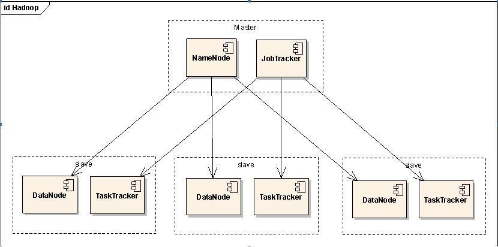
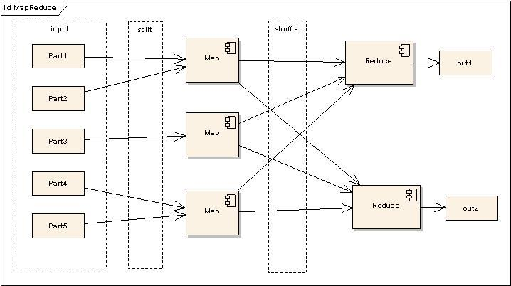
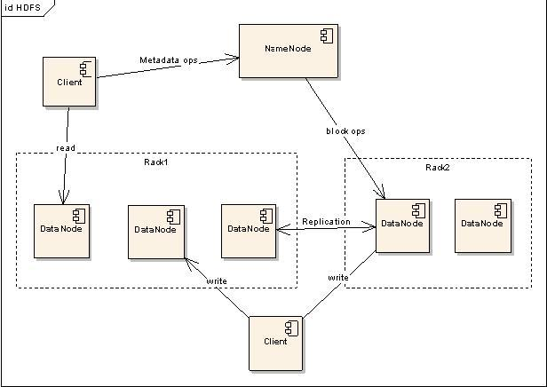

# Hadoop

---
+ MapReduce(Inputs-Split-Map-Shuffle-Reduce-Output)
---

---
+ HDFS
	+ NameNode(单点)
	```
	NameNode可以看作是分布式文件系统中的管理者，
	主要负责管理文件系统的命名空间，集群配置信息，存储块的复制。
	NameNode会存储文件系统的Meta-data在内存中，
	这些信息主要包括了文件信息，每一个文件对应的文件块的信息，每一个文件块在DataNode的信息。
	```
	+ DataNode
	```
	DataNode是文件存储的基本单元。
	它存储Block在本地文件系统中，保存了Block的Meta-data，
	同时周期性的发送所有存在的block的报告给NameNode。
	```
	+ Client
	```
	Client就是需要获取分布式文件系统文件的应用程序。
	```
	+ 操作
		+ 文件写入
		```
		1. Client向NameNode发起文件写入的请求。
		2. NameNode根据文件大小和文件块配置情况，返回给Client它所管理部分DataNode的信息。
		3. Client将文件划分为多个Block，
		   根据DataNode的地址信息，按顺序写入到每一个DataNode块中。
		```
		+ 文件读取
		```
		1. Client向NameNode发起文件读取的请求。
		2. NameNode返回文件存储的DataNode的信息。
		3. Client读取文件信息。
		```
		+ Block 复制
		```
		1. NameNode发现部分文件的block不符合最小复制数或者部分DataNode失效。
		2. 通知DataNode相互复制Block。
		3. DataNode开始直接相互复制。
		```
---

---

+ 分布式计算设计原则
	+ Moving Computation is Cheaper than Moving Data
---
参看资料
+ [分布式计算开源框架Hadoop入门实践](http://blog.csdn.net/cenwenchu79/article/details/2847529)
