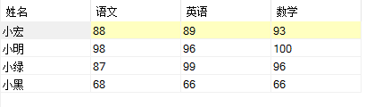
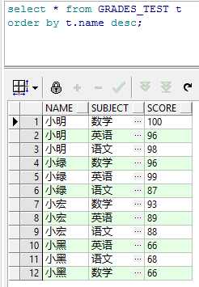
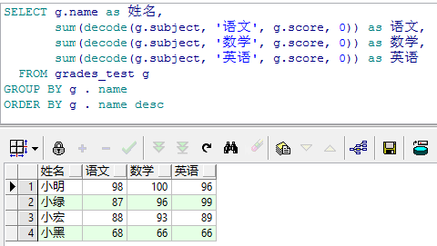

# MySQL数据库操作
### 创建表并插入数据
```
# Host: 127.0.0.1  (Version 5.7.18)
# Date: 2017-09-20 21:38:18
# Generator: MySQL-Front 6.0  (Build 2.20)
#
# Structure for table "grades"
#
CREATE TABLE `grades` (
  `Id` int(11) NOT NULL AUTO_INCREMENT,
  `name` varchar(255) NOT NULL DEFAULT '' COMMENT '学生姓名',
  `subject` varchar(255) DEFAULT '' COMMENT '学科类别',
  `score` varchar(255) DEFAULT NULL COMMENT '学生的成绩',
  PRIMARY KEY (`Id`)
) ENGINE = InnoDB DEFAULT CHARSET = utf8 COMMENT = '学生成绩';
#
# Data for table "grades"
#
INSERT
  INTO `grades`
VALUES
  (2, '小明', '数学', '100'),
  (3, '小明', '语文', '98'),
  (4, '小明', '英语', '96'),
  (8, '小黑', '语文', '68'),
  (9, '小黑', '英语', '66'),
  (10, '小黑', '数学', '66'),
  (11, '小宏', '语文', '88'),
  (12, '小宏', '英语', '89'),
  (13, '小宏', '数学', '93'),
  (14, '小绿', '语文', '87'),
  (15, '小绿', '英语', '99'),
  (16, '小绿', '数学', '96');
  ```
### 完成后的显示结果
---
  

 ### MySQL实现行列转换
 ```
 -- 行列转换使用MAX()函数
SELECT
  `name` AS '姓名', 
  MAX(CASE `subject` WHEN '语文' THEN `score` ELSE 0 END) AS '语文', 
  MAX(CASE `subject` WHEN '英语' THEN `score` ELSE 0 END) AS '英语', 
  MAX(CASE `subject` WHEN '数学' THEN `score` ELSE 0 END) AS '数学'
FROM
  `grades` g
GROUP BY
  `g`.`name`
ORDER BY `g`.`name`
```
---
```
---  行列转换使用SUM()函数，（null 和 0 相同）
SELECT
 `name` AS '姓名', 
 SUM(CASE `subject` WHEN '语文' THEN `score` ELSE null END) AS '语文', 
 SUM(CASE `subject` WHEN '英语' THEN `score` ELSE null END) AS '英语', 
 SUM(CASE `subject` WHEN '数学' THEN `score` ELSE null END) AS '数学'
FROM
 `grades` g
GROUP BY
 `g`.`name`
ORDER BY `g`.`name`
````
### 执行结果
---
  

# Orcal数据库操作
### 创建表并插入数据
```
-- Create table
create table GRADES_TEST
(
  name    VARCHAR2(10) not null,
  subject VARCHAR2(30) not null,
  score   VARCHAR2(10)
)
tablespace TESTDB
  pctfree 10
  initrans 1
  maxtrans 255
  storage
  (
    initial 64K
    next 1M
    minextents 1
    maxextents unlimited
  );
-- Add comments to the columns 
comment on column GRADES_TEST.name
  is '学生姓名';
comment on column GRADES_TEST.subject
  is '学科类别';
comment on column GRADES_TEST.score
  is '分数';

-- insert data
insert into GRADES_TEST (name, subject, score)
values ('小明', '英语', '96');
insert into GRADES_TEST (name, subject, score)
values ('小明', '数学', '100');
insert into GRADES_TEST (name, subject, score)
values ('小黑', '语文', '68');
insert into GRADES_TEST (name, subject, score)
values ('小黑', '英语', '66');
insert into GRADES_TEST (name, subject, score)
values ('小黑', '数学', '66');
insert into GRADES_TEST (name, subject, score)
values ('小宏', '语文', '88');
insert into GRADES_TEST (name, subject, score)
values ('小宏', '英语', '89');
insert into GRADES_TEST (name, subject, score)
values ('小宏', '数学', '93');
insert into GRADES_TEST (name, subject, score)
values ('小绿', '语文', '87');
insert into GRADES_TEST (name, subject, score)
values ('小绿', '英语', '99');
insert into GRADES_TEST (name, subject, score)
values ('小绿', '数学', '96');
insert into GRADES_TEST (name, subject, score)
values ('小明', '语文', '98');
```
### 完成后的显示结果
---
  

### Orcal实现行列转换
```
---  行列转换使用MAX()，DECODE()函数，（null 和 0 不同）
SELECT g.name as 姓名,
       max(decode(g.subject, '语文', g.score, 0)) as 语文,
       max(decode(g.subject, '数学', g.score, 0)) as 数学,
       max(decode(g.subject, '英语', g.score, 0)) as 英语
  FROM grades_test g
GROUP BY g . name
ORDER BY g . name desc
```
---

```
---  行列转换使用SUM()，DECODE()函数函数，（null 和 0 相同）
SELECT g.name as 姓名,
       sum(decode(g.subject, '语文', g.score, null)) as 语文,
       sum(decode(g.subject, '数学', g.score, null)) as 数学,
       sum(decode(g.subject, '英语', g.score, null)) as 英语
  FROM grades_test g
GROUP BY g . name
ORDER BY g . name desc
```
---

```
---  行列转换使用MAX()，CASE()函数函数
SELECT g.name as 姓名,
       MAX(CASE g.subject
             WHEN '语文' THEN
              score
             ELSE
              null
           END) AS 语文,
       MAX(CASE g.subject
             WHEN '英语' THEN
              score
             ELSE
              null
           END) AS 英语,
       MAX(CASE g.subject
             WHEN '数学' THEN
              score
             ELSE
              null
           END) AS 数学
  FROM grades_test g
 GROUP BY g . name
 ORDER BY g . name desc
```
---

```
---  行列转换使用SUM()，CASE()函数函数
SELECT g.name as 姓名,
       sum(CASE g.subject
             WHEN '语文' THEN
              score
             ELSE
              null
           END) AS 语文,
       sum(CASE g.subject
             WHEN '英语' THEN
              score
             ELSE
              null
           END) AS 英语,
       sum(CASE g.subject
             WHEN '数学' THEN
              score
             ELSE
              null
           END) AS 数学
  FROM grades_test g
 GROUP BY g . name
 ORDER BY g . name desc
```
### 执行结果
---
  
