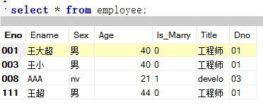
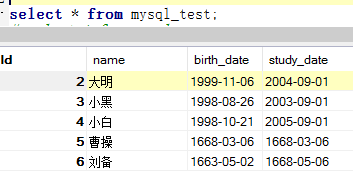
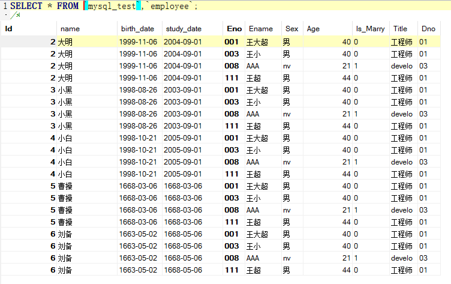
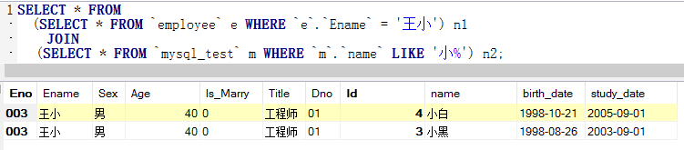

# 表的连接顺序
+ WHERE从句尽可能早地执行，尽量缩小其作用范围
### 初始数据
---

---

---

---
```
# 优化前
SELECT * FROM `mysql_test` m,`employee` e
WHERE `e`.`Ename` = '王小' AND `m`.`name` LIKE '小%';

# 优化后
SELECT * FROM
  (SELECT * FROM `employee` e WHERE `e`.`Ename` = '王小') n1
    JOIN 
	(SELECT * FROM `mysql_test` m WHERE `m`.`name` LIKE '小%') n2;
```
---

---