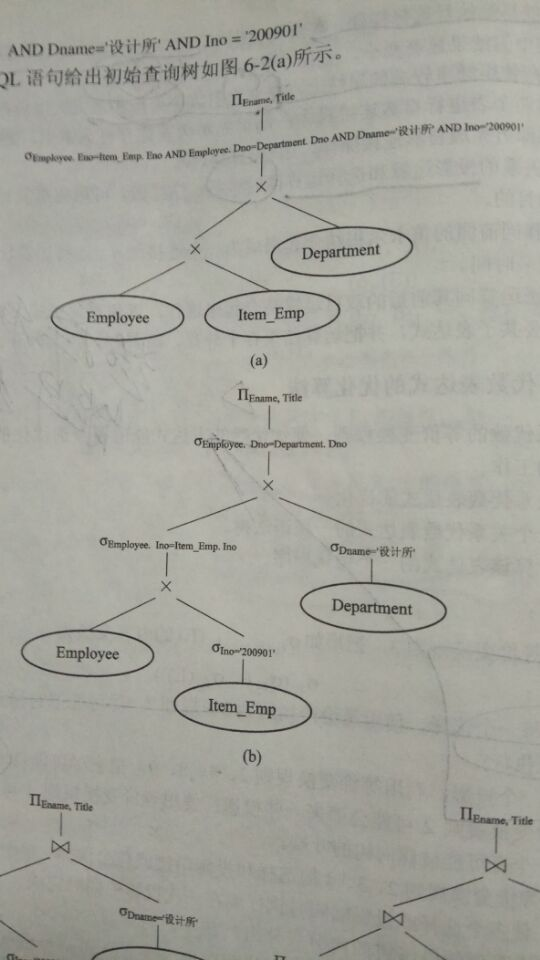
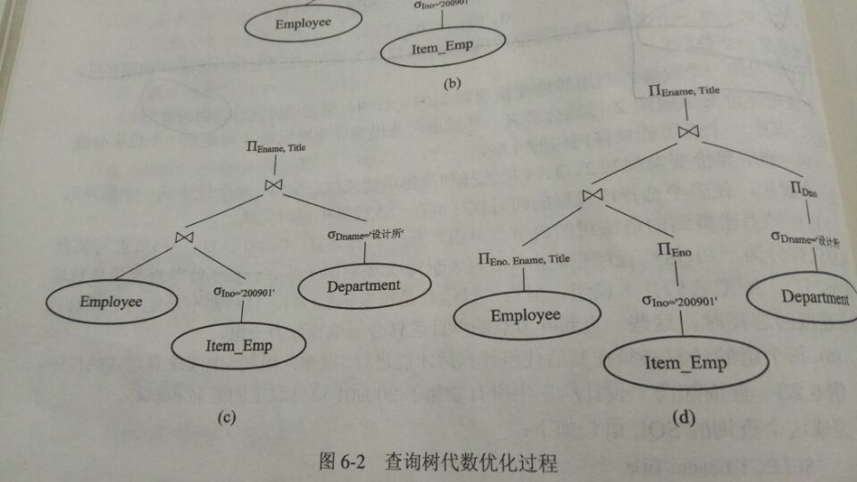

# 查询优化
+ 背景：查询效率地是关系数据模型的主要缺点。
+ 目标：选择有效的策略，等价变换给定的关系表达式，降低结果表达式的求解代价。
+ 优化步骤：
	+ 把查询转换为内部表示形式(如语法树)
	+ 选择合适的等价变换规则，把语法树转换成优化形式。
	+ 选择低层的操作算法，根据存取路径和数据的存储分布情况等为语法树中的每个操作选择最合适的操作算法。
	+ 生成查询执行方案(主要考虑磁盘读写的次数)
+ 一般的优化策略(基本原则：尽早地去除无用信息)
	+ ***尽可能早地执行选择操作(减小中间运算结果，降低运算时间)
	+ **在使用频率较高的属性上建立索引。(如经常在WHERE,ORDER BY,JOIN ON中使用的属性)
	+ *同一关系的选择和投影运算同时进行。
	+ 将选择运算与其前面的笛卡尔积结合成为一个连接运算。
	+ 将投影运算与其前后的双目运算结合起来执行。
	+ 找出公共子表达式并把运算结果存于外存，根据具体需要读入。
+ 示例
```
# 待优化查询语句
# 查询部门'设计所'中参加了'200901'项目职工的姓名和职称
# 职工表：Employee，项目表：Item_Emp，部门表：Department
SELECT Ename,Title
FROM Employee,Item_Emp,Dapartment
WHERE Employee.Eno=Item_Emp.Eno AND Employee.Dno=Dapartment.Dno;
```
### 优化过程
---

---

---