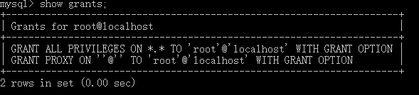
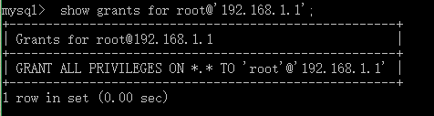

# DCL(Data Control Language)
### 关键字：grant revoke
+ DBA为用户注册|GRANT
	1. 基本格式：
	```
	GRANT<权限列表>on<库.表>TO<用户名@'ip'>[IDENTIFIED BY<口令>][with grant option];
	```
	2. 说明：
	```
	<权限列表>：ALL,insert,select,update,delete,drop,create,alter
	[with grant option]：用户可以将该权限授予其他用户
	```
	3. 示例：
	```
	# 授予用户root对于所有表的全部权限，ip是'192.168.1.1'，口令是"password"
	grant all on *.* to root@'192.168.1.1' identified by "password"; 
	flush privileges; //授权之后，不要忘记更新权限表 
	# 查看当前用户的所有权限
	show grants;
	```
	---
	
	---
	```
	# 查看指定用户root@'192.168.1.1'的权限
	 show grants for root@'192.168.1.1';
	```
	---
	
	---
+ DBA撤销对用户的注册|REVOKE
	1. 基本格式：
	```
	REVOKE<权限列表>on<库.表>FROM<用户名@'ip'>;
	```
	2. 示例
	```
	# 撤销用户的所有权限
	revoke all on *.* from root@'192.168.1.1';
	flush privileges;//刷新权限表
	```