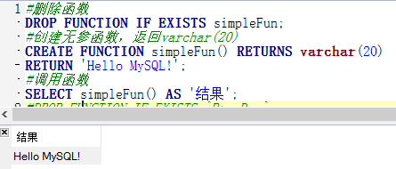
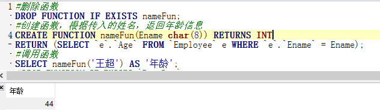

# 函数
+ 优点：
	+ 允许模块化设计程序。函数存储在数据库中，可独立于程序源代码修改。
	+ 每次调用时无需重新解析和优化，缩短了执行时间，执行速度更快。
	+ 减少网络流量。
+ 与存储过程对比
	+ 共同点
		+ 可重复使用编程代码，减少开发时间。
		+ 隐藏SQL细节，给业务开发人员提供良好的数据库操作接口。
		+ 模块化设计便于维护和扩展。
	+ 不同点
		+ 存取过程的权限允许程序执行存储过程而不允许其存取数据表，增强程序安全性。
		+ 函数必须返回一个值。
		+ 存储过程的返回值不能被直接使用而函数可以。

+ 函数定义
### 示例1
```
#删除函数
DROP FUNCTION IF EXISTS simpleFun;
#创建无参函数，返回varchar(20)
CREATE FUNCTION simpleFun() RETURNS varchar(20)
RETURN 'Hello MySQL!';
#调用函数
SELECT simpleFun() AS '结果';
```
---

---
### 示例2
```
#创建函数，根据传入的姓名，返回年龄信息
CREATE FUNCTION nameFun(Ename char(8)) RETURNS INT
RETURN (SELECT `e`.`Age` FROM `Employee` e WHERE `e`.`Ename` = Ename);
#调用函数
SELECT nameFun('王超') AS '年龄';
```
---

---