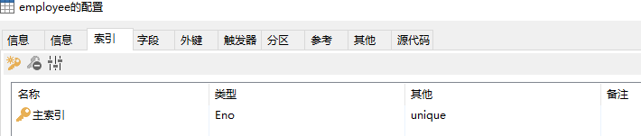
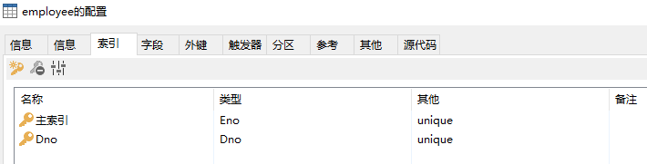
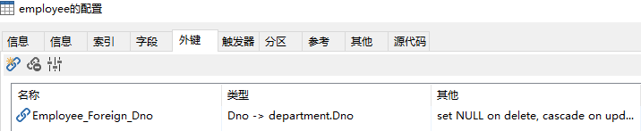

# 完整性约束(保持数据的一致性)
+ 实体完整性约束和主码(PRIMARY KEY 唯一且不能为NULL)
```
# 使用PRIMARY KEY将属性Eno直接说明为主码
CREATE TABLE `Employee` (
  `Eno` char(4) NOT NULL PRIMARY KEY COMMENT '职工号',
  `Ename` char(8) NOT NULL COMMENT '姓名',
  `Sex` char(2) NOT NULL DEFAULT '男' COMMENT '性别',
  `Age` int(11) COMMENT '年龄',
  `Is_Marry` char(1) COMMENT '婚姻状况',
  `Title` char(6) COMMENT '职位',
  `Dno` char(2) COMMENT '部门号'
);
```
---
```
# 在属性列表后单独说明主码
CREATE TABLE `Employee` (
  `Eno` char(4) NOT NULL COMMENT '职工号',
  `Ename` char(8) NOT NULL COMMENT '姓名',
  `Sex` char(2) NOT NULL DEFAULT '男' COMMENT '性别',
  `Age` int(11) COMMENT '年龄',
  `Is_Marry` char(1) COMMENT '婚姻状况',
  `Title` char(6) COMMENT '职位',
  `Dno` char(2) COMMENT '部门号',
  PRIMARY KEY(Eno)#主码说明
);
```
---

---
+ 候选码(UNIQUE 可以有多个且可为NULL)
```
# 使用UNIQUE定义候选码
CREATE TABLE `Employee` (
  `Eno` char(4) NOT NULL COMMENT '职工号',
  `Ename` char(8) NOT NULL COMMENT '姓名',
  `Sex` char(2) NOT NULL DEFAULT '男' COMMENT '性别',
  `Age` int(11) COMMENT '年龄',
  `Is_Marry` char(1) COMMENT '婚姻状况',
  `Title` char(6) COMMENT '职位',
  `Dno` char(2) UNIQUE COMMENT '部门号',
  PRIMARY KEY (`Eno`)
);
```
---

---
+ 参照完整性和外部码
```
# 创建Department表
CREATE TABLE `Department` (
  `Dno` char(2) PRIMARY KEY COMMENT '部门号'
);
```
---
### 说明方式1(隐式说明)REFERENCES<父表名>(<属性名>)
```
# Dno属性是父表(Department)的主键Dno
CREATE TABLE `Employee` (
  `Eno` char(4) NOT NULL COMMENT '职工号',
  `Ename` char(8) NOT NULL COMMENT '姓名',
  `Sex` char(2) NOT NULL DEFAULT '男' COMMENT '性别',
  `Age` int(11) COMMENT '年龄',
  `Is_Marry` char(1) COMMENT '婚姻状况',
  `Title` char(6) COMMENT '职位',
  `Dno` char(2) REFERENCES `Department` (`Dno`),
	 PRIMARY KEY (`Eno`)
);
```
### 说明方式2(显式说明)CONSTRAINT<约束名>FOREIGN KEY(<属性名>) REFERENCES<父表名>(<属性名>)
```
CREATE TABLE `Employee` (
  `Eno` char(4) NOT NULL COMMENT '职工号',
  `Ename` char(8) NOT NULL COMMENT '姓名',
  `Sex` char(2) NOT NULL DEFAULT '男' COMMENT '性别',
  `Age` int(11) DEFAULT NULL COMMENT '年龄',
  `Is_Marry` char(1) DEFAULT NULL COMMENT '婚姻状况',
  `Title` char(6) DEFAULT NULL COMMENT '职位',
  `Dno` char(2) DEFAULT NULL COMMENT '部门号',
  PRIMARY KEY (`Eno`),#主码说明
  KEY `Dno` (`Dno`),#说明Dno为外部码时Dno必须已被说明为码或加了UNIQUE约束
  CONSTRAINT `Employee_Foreign_Dno` FOREIGN KEY (`Dno`) REFERENCES `department` (`Dno`)
);
```
---

---
### 参照完整性约束的实现策略
+ 限制策略
+ 级联策略
+ 置空策略
```
CREATE TABLE `Employee` (
  `Eno` char(4) NOT NULL COMMENT '职工号',
  `Ename` char(8) NOT NULL COMMENT '姓名',
  `Sex` char(2) NOT NULL DEFAULT '男' COMMENT '性别',
  `Age` int(11) DEFAULT NULL COMMENT '年龄',
  `Is_Marry` char(1) DEFAULT NULL COMMENT '婚姻状况',
  `Title` char(6) DEFAULT NULL COMMENT '职位',
  `Dno` char(2) DEFAULT NULL COMMENT '部门号',
  PRIMARY KEY (`Eno`),
  KEY `Dno` (`Dno`),
  CONSTRAINT `Employee_Foreign_Dno` FOREIGN KEY (`Dno`) REFERENCES `department` (`Dno`)
	ON DELETE set null #置空
	ON UPDATE CASCADE) #级联
```
---

---
+ 用户自定义完整性约束：CHECK(<条件>)
```
# 对性别取值进行约束
CREATE TABLE `Employee` (
  `Eno` char(4) NOT NULL COMMENT '职工号',
  `Ename` char(8) NOT NULL COMMENT '姓名',
  `Sex` char(2) NOT NULL DEFAULT '男' COMMENT '性别',
  `Age` int(11) COMMENT '年龄',
  `Is_Marry` char(1) COMMENT '婚姻状况',
  `Title` char(6) COMMENT '职位',
  `Dno` char(2) COMMENT '部门号',
   PRIMARY KEY (`Eno`),
   CONSTRAINT check_1 CHECK(Sex IN('男','女')));
```
+ 删除约束：ALTER TABLE<表名> DROP CONSTRAINT<约束名>
### 备注
+ 可以使用CONSTRAINT<约束名><约束条件>对约束进行命名
+ 完整性约束的检查会花费系统一定的时间，故不可滥用。