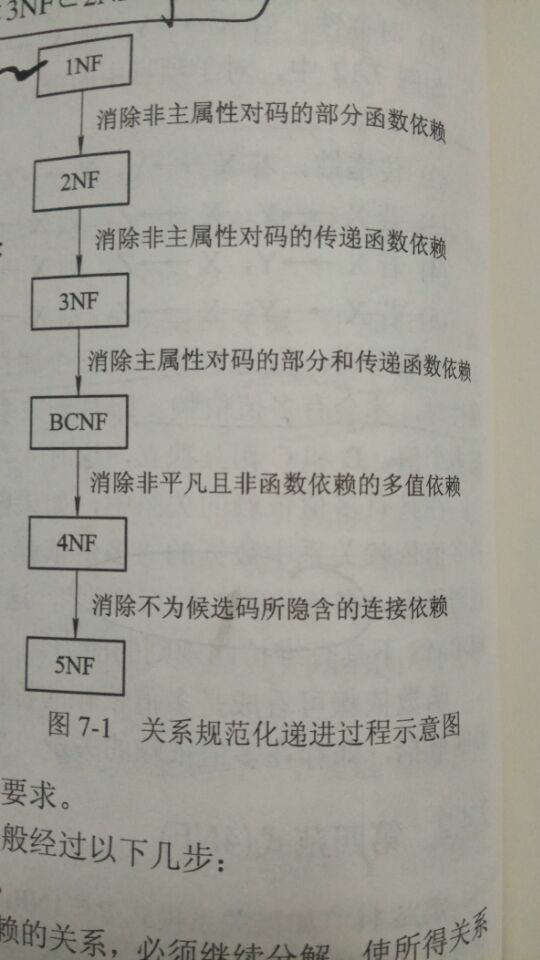

# 关系数据库关系的规范化
+ 规范化；使用形式更为简洁，结构更加规范的关系模式取代原有关系的过程。
	(规范化是为了便于存储，插入和修改，而检索是反规范化)
+ 数据依赖：数据之间相互依赖又相互制约的关系。
	+ 函数依赖(Functional Dependency)
	```
	a.在关系R中，X Y是R的两个属性或属性组，
		存在一个线性映射(并非数值上的对应而是逻辑上的对应)f使得Y=f(X)
		则Y函数依赖于X(或者X决定Y)记作X->Y。
		1.X与Y是1:1联系=>X<->Y
		2.X与Y是m:1联系=>X->Y
		3.X与Y是m:m联系=>X<>Y
	b.在关系R中，X Y是R的两个属性或属性组且X->Y。
	如果存在X的一个真子集X1使得X1->Y，则称Y部分依赖于X；
	否则称Y完全依赖于X。
	c.在关系R中，X Y Z是R的三个不同属性或属性组，其中X->Y，Y->Z但Y<>X且Y不是X的子集则称Z传递依赖于X。
	```
	+ 多值依赖(Multivalued Dependency)
	```
	设R(U)是属性集U上的一个关系模式，X Y Z都是U的子集且Z=U-X-Y
	若果对R(U)的任意关系r，给定一对(X,Z)的值都有一组Y值与之对应并且Y值只取决于X而与Z无关则称
	Y多值依赖于X(或者X多值决定Y),记作X->->Y。
	1. 若果Z是空集，则称X->->Y是平凡的多值依赖，否则为非平凡的多值依赖。
	```
	+ 连接依赖(Join Dependency)
+ 第一范式(1NF)(First Normal Form)
```
如果关系模式R中不包含多值属性则R满足第一范式。
```
+ 第二范式(2NF)
```
如果关系模式R属于1NF且它的所有非主属性都完全依赖于R的任一候选码则R满足第二范式。
推论：如果关系模式R属于1NF且它的所有候选码都是单码则R是2NF。
```
+ 第三范式(3NF)
```
如果关系模式R属于2NF且它的所有非主属性都不传递依赖于任一候选码则称R满足第三范式。
推论1：如果关系模式R属于1NF且它的所有非主属性既不部分依赖也不传递依赖于任何候选码则R是3NF。
推论2：不存在非主属性的关系模式一定是3NF
```
+ Boyee-Codd范式(BCNF)
```
在关系模式R中，如果每一个决定因素都包含码则R满足BCNF。
推论1：如果关系模式R是BCNF则R中所有非主属性对每一个码都是完全函数依赖。
推论2：如果关系模式R是BCNF则R中所有主属性对每一个不包含它的码都是完全函数依赖。
推论3：如果关系模式R是BCNF则R中没有任何属性完全函数依赖于非码的任何一组属性。
定理：如果关系模式R是BCNF则R一定是3FN。
```
+ 第四范式(4NF)
```
如果关系模式R属于1NF，
对于R的每一个非平凡多值依赖X->->Y(Y不是X的子集),X含有码则称R满足第四范式。
推论：如果关系模式R属于4NF则R一定是BCNF。
```
+ 第五范式(5NF)
---

---
