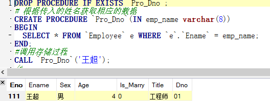

# 存储过程
+ 基本描述：存储过程由一组SQL语句组成，预先编译后存储在数据库中，可供前台应用程序多次调用。使用存储过程既能方便软件开发又能减少解释执行SQL语句时句法分析和查询优化的时间，提高了操作效率。
+ 优点：
	+ 存储过程只在创建时编译一次，提高性能。
	+ 存储过程只在创建时编译一次，提高性能。可以重复使用。
	+ 存储过程位于服务器上，调用时只需要传递名称和参数，减少网络流量。
	+ 参数化的存储过程可以防止SQL注入式攻击，增加了安全性。
+ 存储过程的定义
```
CREATE PROCEDURE<存储过程名称>([IN <参数列表>])
BEGIN
<过程体>
END
```
+ 示例
```
# 删除存储过程
DROP PROCEDURE IF EXISTS `Pro_Dno`;
# 创建存储过程，根据传入的姓名获取相应的数据
CREATE PROCEDURE `Pro_Dno`(IN emp_name varchar(8))
BEGIN
  SELECT * FROM `Employee` e WHERE `e`.`Ename` = emp_name;
END;
#调用存储过程
CALL `Pro_Dno`('王超');
```
---

---