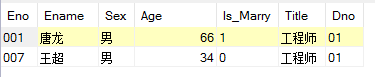

# 视图
+ 描述：视图是虚表，是从一个或多个关系导出的关系，数据库中只有视图的定义而没有实际生成关系。
	1. 试图是虚表，无法建立索引。
	2. 无法修改视图定义(需要先删除原定义再生成新的定义)。
	3. 对视图数据的更新(Insert,delete,update)实质是由DBMS转化为对应基本表的更新。
	4. 语句执行后，视图的定义进入数据字典。
	5. 对视图的查询与对基本表的查询没有区别。
	6. 视图的更新有一定的限制。
	语句中的<子查询>并未执行，只有对视图进行查询时，才会按照定义从基本表中查出数据。
+ 创建视图|CREATE VIEW
	1. 基本格式:

	```
	CREATE VIEW<视图名>[<列名清单>]
	AS <子查询>
	[WITH CHECK OPTION];
	```
	2. 说明:
	```
	[WITH CHECK OPTION]:对视图进行操作时系统自动检查是否符合原定义视图子查询中的<条件表达式>

	```
	3. 示例：
	```
	# 针对部门号为‘01’的数据建立视图
	CREATE
	  VIEW `Employee_View`
	  AS
	SELECT * FROM `Employee` WHERE `Dno` = '01'
	WITH CHECK OPTION;
	```
	---
	
	---
+ 删除视图|DROP VIEW
	1. 基本格式:

	```
	DROP VIEW<视图名>;
	```
	2. 示例：
	```
	DROP VIEW `Employee_View`;
	```
	---
+ 视图的更新
	1. 若视图的列由表达式或常数组成则不允许INSERT和UPDATE，只可以DELETE。
	2. 若视图的列由集函数组成则不允许更新。
	3. 若视图的定义中有DISTINCT|GROUP BY则不允许更新
	4. 若视图的定义中有嵌套查询且内外层FROM子句中的表是同一个表则不允许更新。
	5. 从不允许更新的视图中导出的视图不允许更新。
+ 视图的作用
	1. 视图是三级模式结构中外模式的成分，是数据库中数据的物理独立性和逻辑独立性的重要支柱。
	2. 视图方便用户操作数据库(视图的数据可能来自多个表或多次运算，但对用户来说只有视图这个关系)
	3. 视图使用[WITH CHECK OPTION]可对数据提供安全保护。
	4. 视图是的同一数据对不同用户呈现不同表现形式。
	5. 查询和更新时会有所限制。
